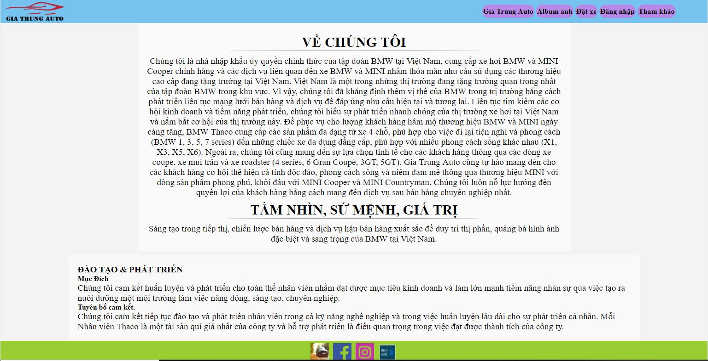
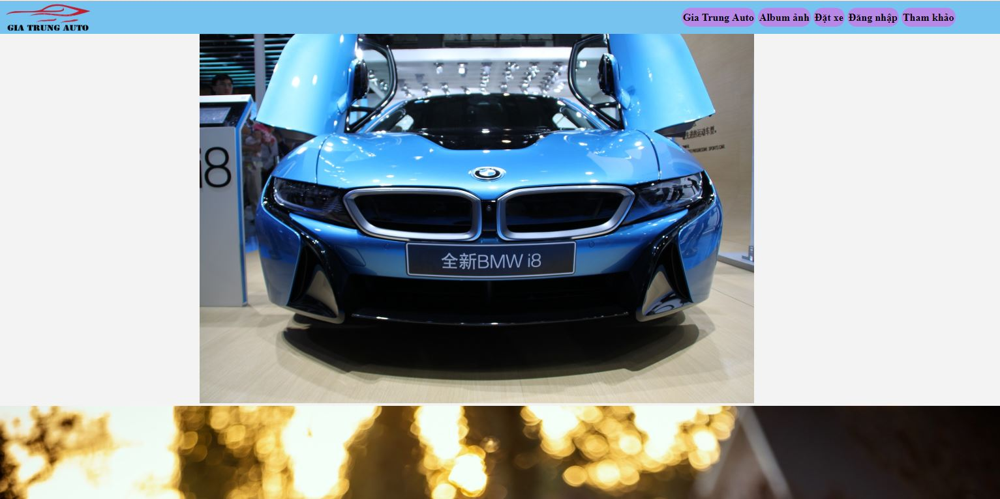
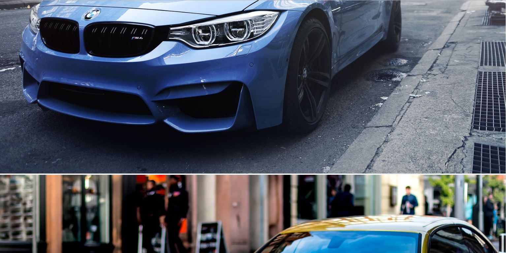
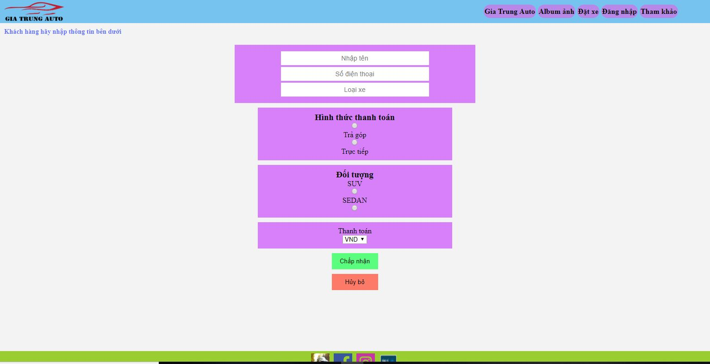
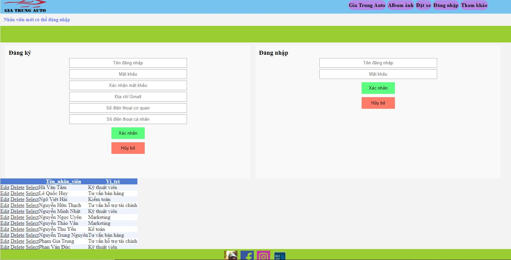
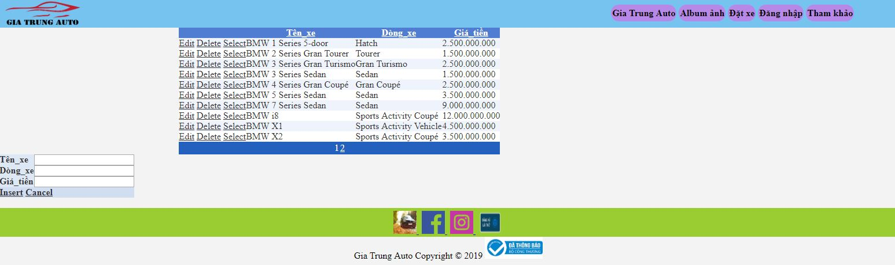
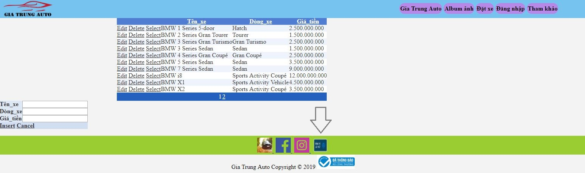
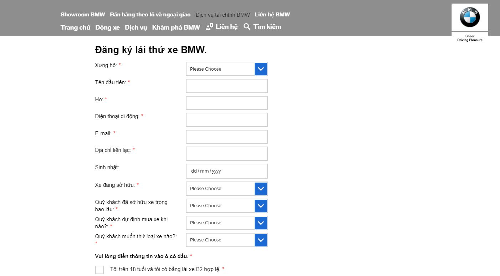

# BT-Website-t- Gia Trung 
Website Ô tô

 Chào mừng bạn đến với Website Gia Trung Auto, Gia Trung Auto là một trong những nhà phân phối ủy quyền của hãng xe danh tiếng BMW của 
Cộng Hòa Liên Bang Đức tại Việt Nam.
Giao diện Website tối giản nhưng cũng khá đẹp mắt giúp quý khách có thể dễ dàng truy cập và tìm xem và mua được những dòng xe mình thích
Giao diện chính của trang web giới thiệu về Gia Trung Auto.(Giao diện bao gồm các trang như Gia Trung Auto, Album ảnh, Đặt xe, Đăng nhập, Tham khảo).
  

Nếu bạn muốn xem những hình ảnh đẹp về xe bạn có thể click chuột vào trang Album ảnh lúc này trang sẽ được chuyển qua trang mới chứa bao gồm các hình ảnh đẹp mắt về xe.

Nếu bạn có nhu cầu về đặt xe bạn có thể click chuột vào trang đặt xe lúc này bạn sẽ được chuyển qua trang mới để tiến hành các thao tác đặt xe.

Về trang đăng nhập thì trang này chỉ dành cho các thành viên và nhân viên đăng nhập vào để làm việc, và danh dách nhân viên cũng được thể hiện lên thông qua CSDL nhân viên.

Nếu bạn muốn tham khảo về giá xe cũng như về các dòng xe mà Gia Trung Auto đang kinh doanh thì các bạn có thể click chuột vào trang tham khảo bên trên, lúc này bạn sẽ được chuyển qua trang chứa các thông tin về xe như tên xe, dòng xe đó thuộc dòng nào và bạn có thể tham khảo giá tiền hiện hành của dòng xe đó.

Bạn có nhu cầu về lái thử xe ở đây chúng tôi có liên kết với BMW Việt Nam hỗ trợ bạn lái thử xe và chọn cho mình dòng xe phù hợp với mình nhất có thể, bạn có thể rê chuột vào biểu tượng đăng kí lái thử phía bên dưới (bạn có thể xem ảnh bên dưới).

Lúc này bạn sẽ được thấy chuyển qua một trang mới mà chúng tôi liên kết với BMW hỗ trợ bạn việc lái thử xe, lúc này bạn chỉ cần nhập đúng thông tin và đăng kí lái thử.

Kế bên đăng kí lái thử xe là hai biểu tượng Instagram và Facebook và một hình ảnh nho nhỏ (bạn click vào biểu tượng Instagram bạn có thể truy cập vào Instagram của BMW Việt Nam, còn biểu tượng Facebook khi bạn click vào bạn có thể truy cập vào Facebook của BMW Việt Nam, còn hình ảnh nho nhỏ, bạn click vào bạn có thể truy cập vào trang chính của BMW Việt Nam).

CẢM ƠN THẦY ĐÃ XEM BÀI CỦA EM !!!

